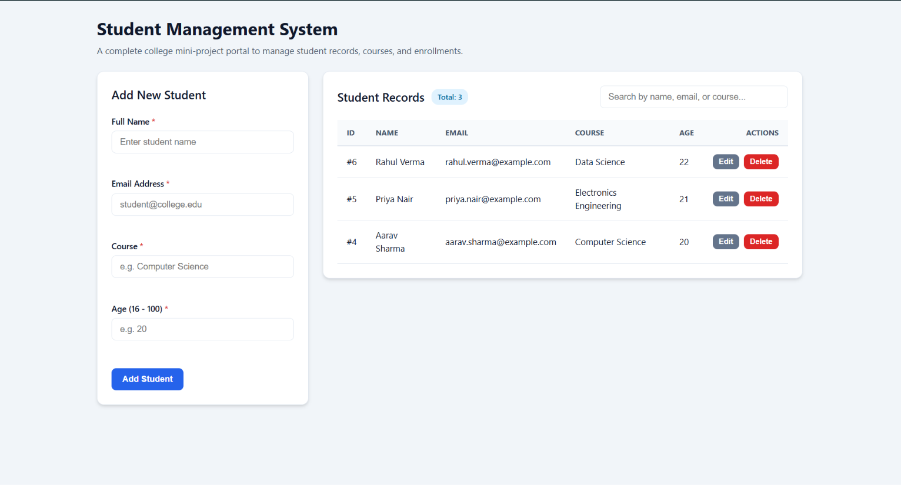
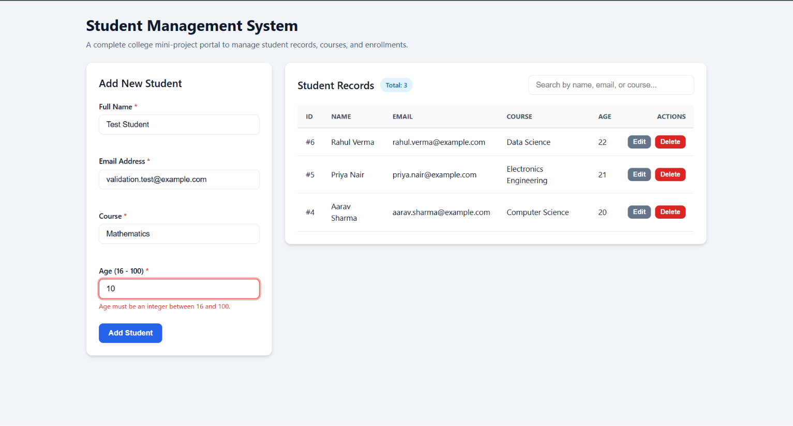
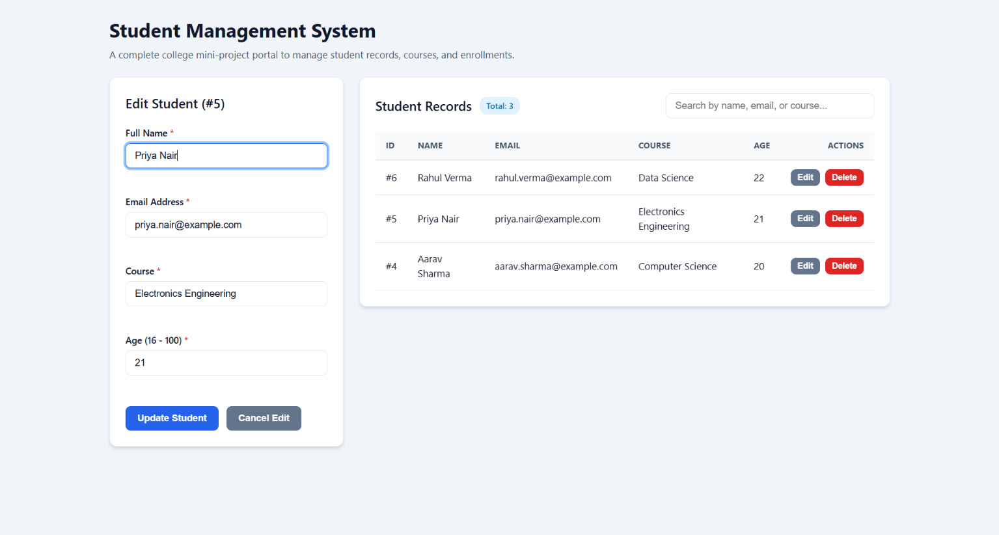
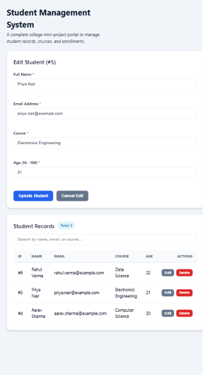
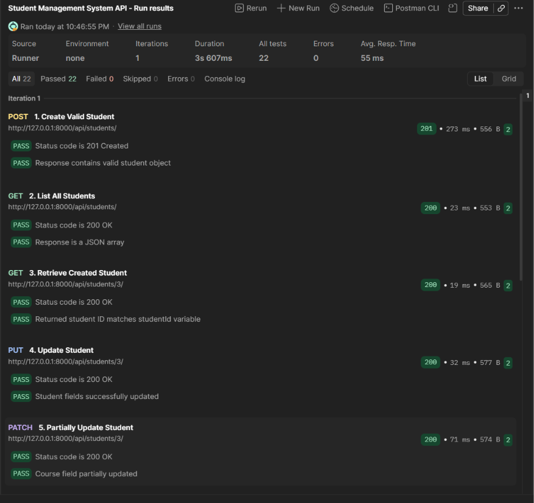

# Student Management System

A full-stack web application designed for academic institution management to create, view, update, search, and delete student records. Built with a **Django REST Framework** backend, an **SQLite** database, and a self-contained **Vanilla HTML/CSS/JavaScript** frontend.

🌐 **Live Demo:** [https://student-management-system-zp79.onrender.com](https://student-management-system-zp79.onrender.com)

---

## 📌 Table of Contents
- [Project Overview](#project-overview)
- [Problem Statement](#problem-statement)
- [Objectives](#objectives)
- [Features](#features)
- [Screenshots](#screenshots)
- [Technology Stack](#technology-stack)
- [System Architecture](#system-architecture)
- [Project Folder Structure](#project-folder-structure)
- [Prerequisites](#prerequisites)
- [Installation & Setup Guide](#installation--setup-guide)
- [API Endpoint Documentation](#api-endpoint-documentation)
- [Data Fields & Validation Rules](#data-fields--validation-rules)
- [Automated Testing](#automated-testing)
- [Testing Summary](#testing-summary)
- [Security & Quality Measures](#security--quality-measures)
- [Future Enhancements](#future-enhancements)
- [Live Deployment](#live-deployment)
- [Repository Link](#repository-link)

---

## 📖 Project Overview
The **Student Management System** is a lightweight, responsive college mini-project that provides a user-friendly management portal. Educational administrators can register students, assign them to academic courses, track their contact details, and update or remove records seamlessly.

The project features decoupled architecture: a RESTful API backend handling data validation, persistence, and business logic, coupled with a responsive, accessible single-page frontend interface.

---

## 🎯 Problem Statement
Educational institutions often struggle with manual paper-based or disjointed spreadsheet records to track student enrollments, course distributions, and contact information. This leads to duplicate records, invalid data entries (such as erroneous ages or malformed emails), and slow record retrieval. 

The Student Management System solves these issues by providing a centralized database backed by automated data validation rules and real-time search capabilities.

---

## 🚀 Objectives
- Build a RESTful API service adhering to HTTP standard practices.
- Implement robust data validation on both client and server layers.
- Develop a clean single-page web interface without heavy JavaScript dependencies.
- Ensure total data integrity with automated database migrations and backend unit test coverage.

---

## ✨ Features
- **Create Students**: Add new student entries with real-time validation checks.
- **View Students**: List all enrolled students in a structured data table with an interactive total counter.
- **Update Students**: Pre-fill and edit existing student records via dynamic form transformation (`Add Student` $\rightarrow$ `Update Student`).
- **Delete Students**: Remove student records with browser confirmation dialogs to prevent accidental deletions.
- **Real-Time Client-Side Search**: Instantly filter table records by matching student Name, Email, or Course.
- **Dual Validation Layer**: Form input is validated in the browser before submission, while Django REST Framework enforces model constraints on the server.
- **Responsive Interface**: Adapts seamlessly to Desktop, Tablet, and Mobile screen resolutions.
- **Clear Notifications**: Interactive success toasts and detailed error banners for field-level validation feedback.

---

## 🖼️ Screenshots

### Desktop Dashboard & Student Records

*Desktop dashboard and student records*

### Client-Side Validation

*Client-side age validation*

### Student Update Interface

*Student update interface*

### Responsive Mobile Layout

*Responsive mobile layout*

### Postman API Test Suite Results

*Postman collection result showing 22 passed and 0 failed*

---

## 🛠️ Technology Stack
- **Frontend**: Plain HTML5, CSS3, JavaScript (ES6+ Vanilla JS)
- **Backend**: Python 3.13, Django 6.1, Django REST Framework (DRF) 3.18
- **Database**: SQLite3
- **CORS Management**: `django-cors-headers`
- **Version Control**: Git & GitHub

---

## 🏗️ System Architecture

The project follows a decoupled client-server pattern:

```text
Browser Frontend  ──(HTTP / JSON)──>  REST API  ──>  Django REST Framework  ──>  Django ORM  ──>  SQLite Database
```

1. **Browser Frontend**: Sends asynchronous HTTP requests (`fetch API`) formatted as JSON.
2. **REST API (Router & Views)**: Dispatches requests through Django REST Framework ViewSets.
3. **Serializer Layer**: Validates JSON payloads and maps Python dictionaries to ORM models.
4. **Django ORM**: Executes database queries against the local `db.sqlite3` storage.

---

## 📁 Project Folder Structure

```text
student-management-system/
├── .gitignore               # Ignored files (venv, pycache, db.sqlite3)
├── requirements.txt         # Python project dependencies
├── README.md                # Project documentation
├── .venv/                   # Python virtual environment (ignored by Git)
├── docs/                    # Project documentation & assets
│   ├── postman/             # Postman API Collection
│   │   └── Student_Management_API.postman_collection.json
│   └── screenshots/         # Application & testing screenshots
│       ├── edit-student.png
│       ├── postman-test-results.png
│       ├── responsive-mobile.png
│       ├── student-dashboard.png
│       └── validation-error.png
├── frontend/                # Self-contained frontend application
│   ├── index.html           # HTML5 structure & accessibility labels
│   ├── styles.css           # Plain CSS responsive layout & styling
│   └── app.js               # ES6 Vanilla JS client & API integration
└── backend/                 # Django backend project
    ├── db.sqlite3           # SQLite database
    ├── manage.py            # Django management CLI script
    ├── backend/             # Django project configuration
    │   ├── __init__.py
    │   ├── asgi.py
    │   ├── settings.py      # App settings & CORS configuration
    │   ├── urls.py          # Top-level URL routing (/api/)
    │   └── wsgi.py
    └── students/            # Django app for student domain
        ├── __init__.py
        ├── admin.py         # Django Admin registration
        ├── apps.py
        ├── migrations/      # Database migrations
        │   └── 0001_initial.py
        ├── models.py        # Student database model & validators
        ├── serializers.py   # DRF ModelSerializer & validation logic
        ├── tests.py         # Automated API test suite (11 unit tests)
        ├── urls.py          # DRF DefaultRouter endpoints
        └── views.py         # StudentViewSet (ModelViewSet)
```

---

## ⚡ Prerequisites
Make sure you have the following installed on your machine:
- **Python**: Version `3.10` or higher
- **Git**: Installed and configured
- **Web Browser**: Any modern browser (Chrome, Firefox, Edge, Safari)

---

## 💻 Installation & Setup Guide

Execute these steps in **Windows PowerShell**:

### 1. Clone the Repository
```powershell
git clone https://github.com/mani-538/student-management-system.git
cd student-management-system
```

### 2. Create and Activate Virtual Environment
```powershell
python -m venv .venv
```

### 3. Install Dependencies
```powershell
.\.venv\Scripts\pip.exe install -r requirements.txt
```

### 4. Run Database Migrations
```powershell
.\.venv\Scripts\python.exe backend\manage.py migrate
```

### 5. Start the Backend API Server
```powershell
.\.venv\Scripts\python.exe backend\manage.py runserver
```
*The backend API will be live at `http://127.0.0.1:8000/api/students/`.*

### 6. Start the Frontend Server (Open a Second PowerShell Terminal)
Navigate to the project root directory and run:
```powershell
.\.venv\Scripts\python.exe -m http.server 5500 --directory frontend
```

### 7. Access the Application
Open your browser and navigate to:
```text
http://127.0.0.1:5500
```

---

## 📡 API Endpoint Documentation

| Method | Endpoint | Description | Status Codes |
| :--- | :--- | :--- | :--- |
| **POST** | `/api/students/` | Create a new student record | `201 Created`, `400 Bad Request` |
| **GET** | `/api/students/` | Retrieve a list of all students | `200 OK` |
| **GET** | `/api/students/<id>/` | Retrieve details of a specific student | `200 OK`, `404 Not Found` |
| **PUT** | `/api/students/<id>/` | Replace all fields of a student record | `200 OK`, `400 Bad Request`, `404 Not Found` |
| **PATCH** | `/api/students/<id>/` | Partially update fields of a student record | `200 OK`, `400 Bad Request`, `404 Not Found` |
| **DELETE** | `/api/students/<id>/` | Delete a student record by ID | `204 No Content`, `404 Not Found` |

---

## 📋 Data Fields & Validation Rules

| Field Name | Type | Access Level | Validation Rules |
| :--- | :--- | :--- | :--- |
| `id` | Integer | Read-Only | Auto-incrementing primary key |
| `name` | String | Required | Max length: 100. Cannot be blank or contain only spaces. |
| `email` | String | Required | Max length: 254. Must be a valid format, unique, and auto-converted to lowercase. |
| `course` | String | Required | Max length: 100. Cannot be blank or contain only spaces. |
| `age` | Integer | Required | Positive integer. Minimum: **16**, Maximum: **100**. |
| `created_at` | DateTime | Read-Only | Automatically recorded upon record creation. |
| `updated_at` | DateTime | Read-Only | Automatically updated upon modification. |

---

## 🧪 Automated Testing

The backend includes a comprehensive unit test suite written with `rest_framework.test.APITestCase`.

### Running Tests
To run all test cases, execute:
```powershell
.\.venv\Scripts\python.exe backend\manage.py test
```

### Current Test Suite Results
```text
Creating test database for alias 'default'...
...........
----------------------------------------------------------------------
Ran 11 tests in 0.206s

OK
Destroying test database for alias 'default'...
System check identified no issues (0 silenced).
```
**Result**: **`11 / 11 tests passing`** (`0 failures`, `0 errors`).

#### Verified Test Cases:
1. `test_create_valid_student`: Creates a student and verifies field values and lowercase conversion.
2. `test_list_students`: Ensures all student records are listed.
3. `test_retrieve_single_student`: Verifies detail lookup by student ID.
4. `test_update_student`: Tests `PUT` and `PATCH` record updates.
5. `test_delete_student`: Verifies record deletion (`204 No Content`).
6. `test_empty_required_fields`: Confirms rejection of whitespace-only strings.
7. `test_invalid_email_format`: Validates rejection of malformed email addresses.
8. `test_duplicate_email`: Ensures unique constraint enforcement for duplicate emails.
9. `test_age_below_minimum`: Enforces minimum age boundary ($< 16$).
10. `test_age_above_maximum`: Enforces maximum age boundary ($> 100$).
11. `test_nonexistent_student_id`: Confirms `404 Not Found` response for invalid IDs.

---

## 📊 Testing Summary

- **11 Django automated tests passed** (0 failures, 0 errors).
- **22 Postman assertions passed**.
- **0 Postman assertions failed**.
- **Browser CRUD and responsive-layout testing passed**.

---

## 🛡️ Security & Quality Measures
- **Safe DOM Rendering**: All user-generated text data is appended using `textContent` and native DOM nodes to prevent Cross-Site Scripting (XSS) vulnerabilities.
- **CORS Middleware**: Explicitly configured using `django-cors-headers` to enable controlled cross-origin communication between `http://127.0.0.1:5500` and the API.
- **Double Submission Guard**: Submit buttons are disabled during pending HTTP requests to prevent duplicate POST creation.
- **Input Normalization**: Email strings are automatically trimmed and lowercased before database insertion.

---

## 🔮 Future Enhancements
- **Pagination**: Support server-side pagination for large student bodies.
- **User Authentication**: Add JWT/Session-based authentication for institutional admin roles.
- **Export Capabilities**: Allow exporting student tables to CSV and PDF formats.
- **Department & Grade Tracking**: Extend data models to track GPA, major, and semester enrollment.

---

## 🌐 Live Deployment

The application is publicly deployed on Render with a PostgreSQL database:

[Open the live Student Management System](https://student-management-system-zp79.onrender.com)

> The free Render service may take up to one minute to start after a period of inactivity.

---

## 🔗 Repository Link
GitHub Repository: [https://github.com/mani-538/student-management-system.git](https://github.com/mani-538/student-management-system.git)
